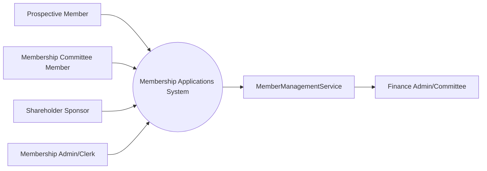

# Membership Applications – Actors

## Actor List

### Primary Actors
- **Prospective Member (Applicant)**: Person applying for membership and providing required personal/application details.
- **Membership Committee Member**: Reviews applications and records application decisions.

### Supporting Actors
- **Shareholder Sponsor**: Existing shareholder associated to an applicant; sponsor eligibility may be validated (5+ years, good standing, annual sponsorship limits).
- **Membership Admin/Clerk**: Supports intake, data quality checks, and review preparation.
- **MemberManagementService**: Creates/activates a member account when application status is accepted.
- **Finance Admin/Committee**: Uses accepted-member data for account and fee lifecycle processes.

## Actor Context Diagram

## Notes
- This actor model intentionally minimizes scope to support a two-use-case analysis baseline.
- Additional actors (e.g., notification or identity services) can be added later when implementation and non-functional concerns are elaborated.
