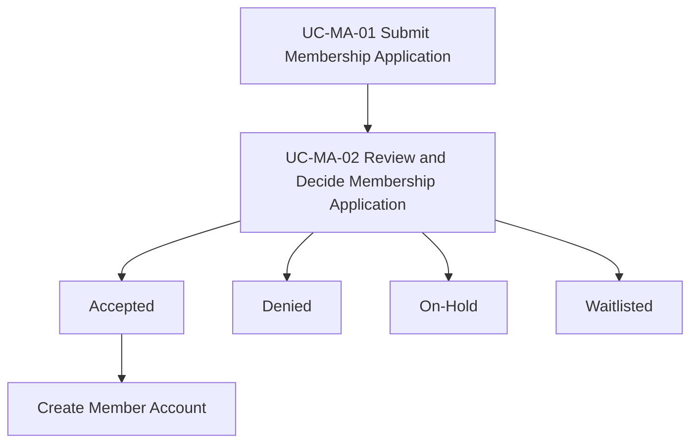

# Membership Applications – Use Case Catalog (Reduced)

## Scope Decision
To keep analysis practical and aligned with current planning needs, the Membership Applications domain is reduced to **2 core use cases**, with alternative flows capturing other outcomes.

## Use Cases
1. **UC-MA-01 Submit Membership Application**
2. **UC-MA-02 Review and Decide Membership Application**

## Coverage Mapping

| Required behavior | Covered in |
|---|---|
| Applicant submits application | UC-MA-01 main flow |
| Sponsor and data completeness validation | UC-MA-01 alternate flows |
| Monthly committee review operation | UC-MA-02 preconditions + trigger |
| Accepted/Denied/On-Hold/Waitlisted outcomes | UC-MA-02 main + alternate flows |
| Member account creation after acceptance | UC-MA-02 postcondition / alternate flow |
| Application status history | UC-MA-02 business rules + postconditions |

## Use Case Relationship Diagram

