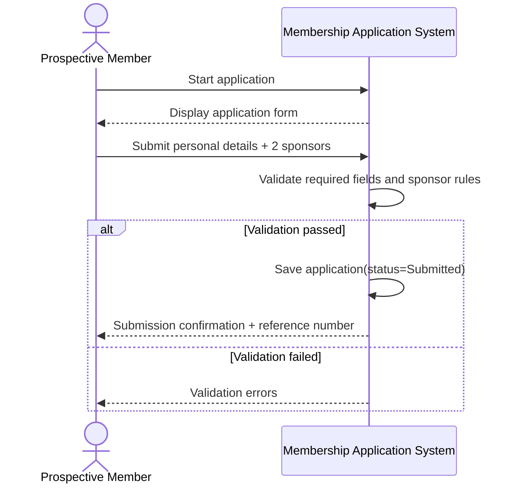

# UC-MA-01 – Submit Membership Application

## Goal / Brief Description
Allow a prospective member to submit a complete membership application with required personal details and sponsor information so it can be reviewed by the membership committee.

## Primary Actor
- Prospective Member (Applicant)

## Supporting Actors
- Shareholder Sponsor
- Membership Admin/Clerk

## Trigger
- Applicant chooses to submit a new membership application.

## Preconditions
1. Applicant has sponsor details for two shareholder sponsors.

## Postconditions
### Success
1. Application is stored with status `Submitted`.
2. Submission timestamp is recorded.
3. Application is available to committee review queue.

### Failure / Partial
1. Application is not submitted.
2. Validation issues are shown and must be corrected.

## Main Success Flow
1. Applicant starts new membership application.
2. System displays required application fields.
3. Applicant enters personal/contact details.
4. Applicant provides two sponsor identities.
5. Applicant confirms declaration and submits.
6. System validates completeness and basic business rules.
7. System stores application and sets status to `Submitted`.
8. System confirms submission.

## Alternate Flows
### A1 – Missing Required Data
- At step 6, required fields are missing.
- System displays field-level errors.
- Flow returns to step 3.

### A2 – Sponsor Eligibility Fails
- At step 6, one or both sponsors fail eligibility checks (e.g., not in good standing, sponsorship limit reached).
- System rejects submission and explains which sponsor criteria failed.
- Applicant updates sponsor info and returns to step 4.

### A3 – Staff-Assisted Entry *(Out of Current Roadmap Scope)*
- Membership Admin/Clerk enters the application on behalf of applicant.
- System records submitter role as staff-assisted submission.
- This flow is documented for future consideration and is not targeted in the current roadmap.

## Exceptions
- **E1: System Unavailable**: Submission cannot be completed; system logs event and user retries later.

## Related Business Rules / Notes
1. Prospective members require two existing shareholder sponsors.
2. Eligible sponsor criteria: member >= 5 years, good standing, and sponsorship limits per year.
3. Application data is for membership processing/roster purposes (privacy constraint).

## Initial SSD (System Sequence Diagram)

