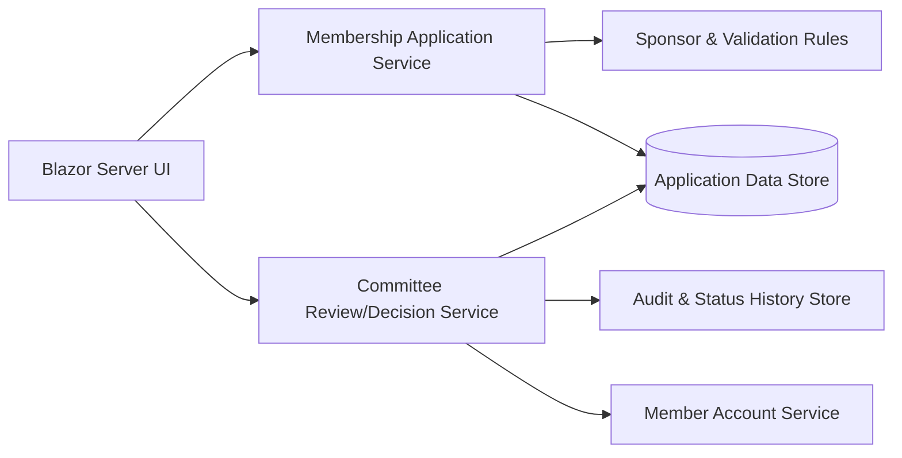

# Membership Applications – Initial Component View

## Purpose
Provide a planning-level component diagram that remains consistent with the two core use cases.

## Mapping to Use Cases
- **UC-MA-01 Submit Membership Application**: UI, Membership Application Service, Sponsor & Validation Rules, Application Data Store.
- **UC-MA-02 Review and Decide Membership Application**: UI, Committee Review/Decision Service, Audit & Status History Store, Member Account Service (accepted outcomes).
