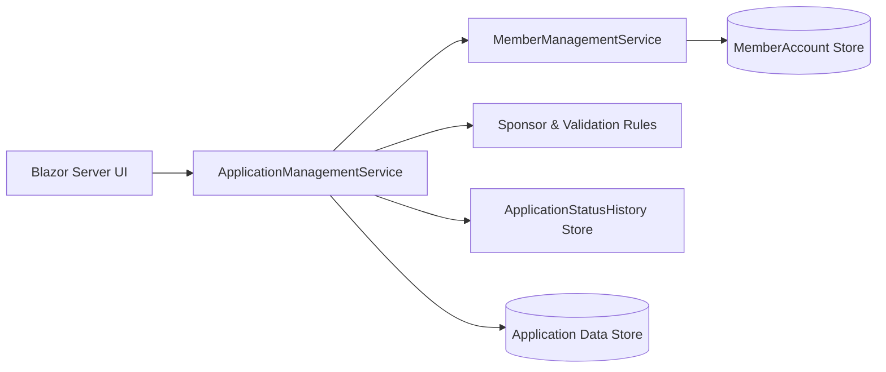

# Membership Applications – Initial Component View

## Purpose
Provide a planning-level component diagram aligned with the current service model.

## Mapping to Use Cases
- **UC-MA-01 Submit Membership Application**: UI, `ApplicationManagementService`, Sponsor & Validation Rules, Application Data Store.
- **UC-MA-02 Review and Decide Membership Application**: UI, `ApplicationManagementService`, ApplicationStatusHistory Store, and `MemberManagementService` for accepted outcomes.
