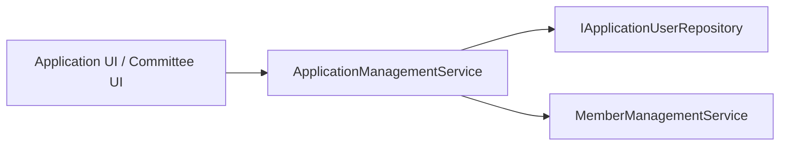

# ApplicationManagementService (Domain/Application Service)

## Purpose
Coordinate the end-to-end membership application workflow for submission, review, and status decisions.

## Current Scope (v1)
- Submit a new membership application.
- Retrieve actionable applications for committee review.
- Change application status (`Submitted`, `OnHold`, `Waitlisted`, `Accepted`, `Denied`).
- Trigger member-account creation workflow when status becomes `Accepted`.

## Responsibilities
- Validate submission payload completeness before creating a `MembershipApplication`.
- Persist new applications with initial `Submitted` status.
- Return review queues filtered to actionable statuses.
- Validate and apply status transitions per allowed rules.
- Record status-history entries when status changes.
- Trigger downstream member creation via `MemberManagementService` on acceptance.

## Core Operations (v1)
- `SubmitApplicationAsync(submitRequest, submittedByUserId, cancellationToken)`
- `GetActionableApplicationsAsync(filter, cancellationToken)`
- `ChangeApplicationStatusAsync(applicationId, newStatus, changedByUserId, changedAt, cancellationToken)`
- `RecordStatusHistoryAsync(applicationId, fromStatus, toStatus, changedByUserId, changedAt, cancellationToken)`

## Inputs/Outputs (high-level)

### SubmitApplicationAsync
**Inputs**
- Applicant-linked `ApplicationUserId`
- Required membership application fields
- Sponsor member IDs

**Outputs**
- `ApplicationId`
- `CurrentStatus`
- `SubmittedAt`

### GetActionableApplicationsAsync
**Inputs**
- Optional filters (status, date range, paging)

**Outputs**
- List of applications in actionable statuses (`Submitted`, `OnHold`, `Waitlisted`)

### ChangeApplicationStatusAsync
**Inputs**
- `ApplicationId`
- `NewStatus`
- `ChangedByUserId`
- `ChangedAt`

**Outputs**
- Updated application summary (`ApplicationId`, `CurrentStatus`, `LastStatusChangedAt`)
- Optional member creation result when `NewStatus = Accepted`

## Invariants / Rules (v1)
- New applications are created with initial status `Submitted`.
- Required application fields and sponsor IDs must be present before submission.
- Status transitions must follow allowed transition rules.
- Every status change records an `ApplicationStatusHistory` entry.
- `Accepted` and `Denied` are terminal statuses in v1.
- If status is changed to `Accepted`, member creation workflow is invoked.

## Deferred / Future (currently unplanned)
- Additional sponsor eligibility policy checks beyond baseline completeness.
- Rich search/sorting/reporting for review queues.
- Bulk review/decision operations.

## Explicit Non-Rule (current design)
- This service does not own identity user lifecycle management; it consumes existing `ApplicationUser` data.

## Suggested Dependencies
- `IApplicationUserRepository` (or Identity user manager abstraction)
- `MemberManagementService`

## Mermaid Service Context

