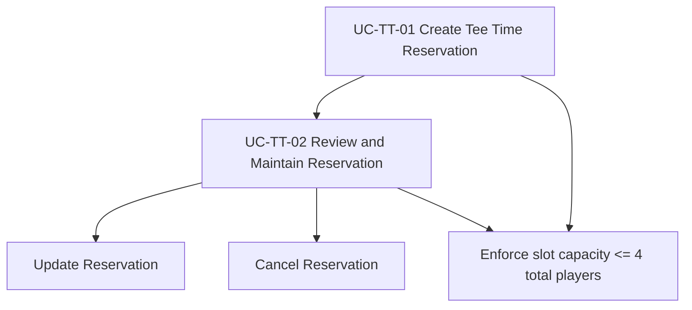

# Tee Time Reservations – Use Case Catalog (Initial Backend Focus)

## Scope Decision
To start backend planning with practical delivery value, Tee Time Reservations are reduced to **2 core use cases** that cover the reservation lifecycle.

## Use Cases
1. **UC-TT-01 Create Tee Time Reservation**
2. **UC-TT-02 Review and Maintain Reservation**

## Coverage Mapping

| Required behavior | Covered in |
|---|---|
| Active member creates reservation | UC-TT-01 main flow |
| Season-based booking window | UC-TT-01 business rules |
| Membership-type time-of-day restrictions | UC-TT-01 validation rules |
| Shared slot capacity up to 4 total players across multiple bookings | UC-TT-01 business rules + alternates |
| View, update, cancel reservation | UC-TT-02 main + alternate flows |
| Atomic occupancy updates on edit/cancel | UC-TT-02 main flow + exceptions |
| Admin/staff reservation support | UC-TT-01 and UC-TT-02 supporting actor + alternates |

## Use Case Relationship Diagram

