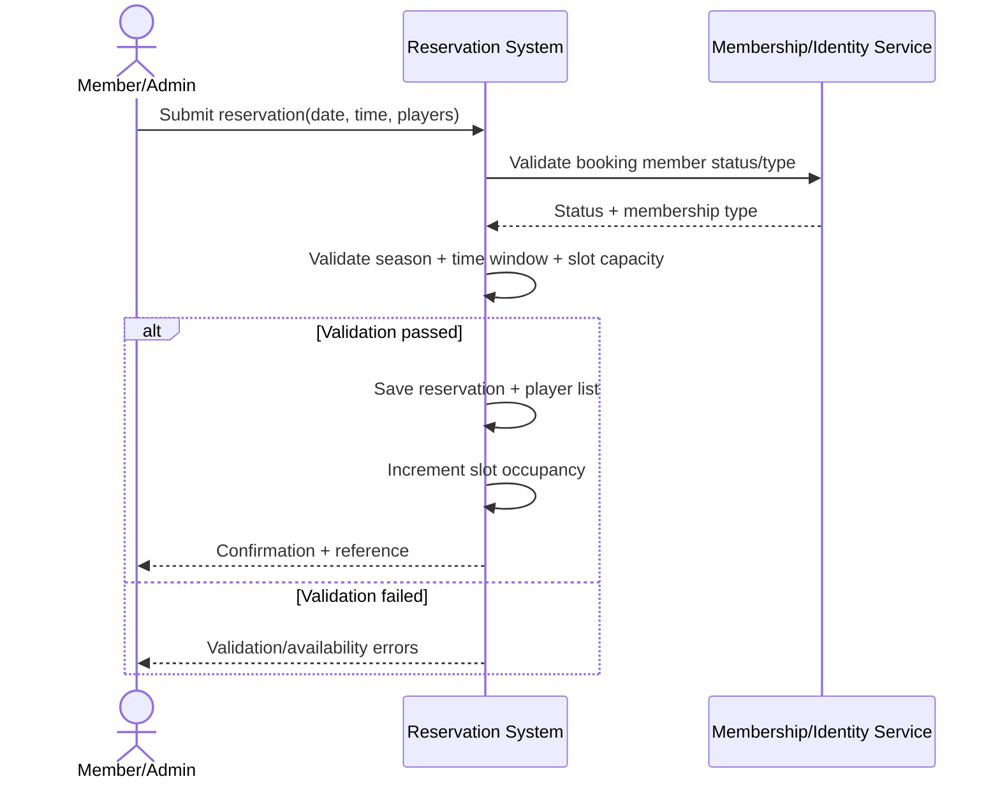

# UC-TT-01 – Create Tee Time Reservation

## Goal / Brief Description
Allow an active member (or authorized staff acting on behalf of a member) to create a tee-time reservation for one or more individual players, while enforcing season eligibility, membership time-window rules, and shared slot capacity.

## Primary Actor
- Member

## Supporting Actors
- Admin/Clerk
- Membership/Identity Service
- Reservation Service

## Trigger
- Actor submits a new tee-time booking request for a selected date and start time.

## Preconditions
1. Booking member exists and is active/in good standing.
2. Requested date is within the golf season.
3. Requested start time is a valid tee-time slot.
4. Booking member's membership type is authorized for the selected date/time.

## Postconditions
### Success
1. Reservation is stored with a unique reference.
2. Individual players are linked to the reservation.
3. Slot occupancy is incremented by the number of players in the reservation.
4. Remaining slot capacity is updated.

### Failure / Partial
1. Reservation is not stored.
2. Validation or availability errors are returned.

## Main Success Flow
1. Actor opens create-reservation workflow.
2. System displays available season dates, valid start times, and remaining slot capacity.
3. Actor selects date/time and enters individual players for the booking.
4. System validates member status and membership-type time eligibility based on the booking member.
5. System validates each player entry and requested count.
6. System validates slot capacity for the selected start time.
7. System creates reservation and stores player list.
8. System updates slot occupancy.
9. System returns confirmation.

## Alternate Flows
### A1 – Slot Full
- At step 6, selected start-time slot has no remaining capacity.
- System rejects request and prompts actor to choose a different slot.

### A2 – Requested Players Exceed Remaining Capacity
- At step 6, requested player count exceeds remaining capacity.
- System rejects request and returns remaining capacity value.

### A3 – Membership Time Restriction Violated
- At step 4, selected time is not allowed for the booking member's membership type.
- System rejects request and displays allowed windows.

### A4 – Inactive Member
- At step 4, booking member is not active.
- System rejects request and explains status restriction.

### A5 – Staff-Assisted Booking
- Admin/Clerk performs the workflow on behalf of an active member.
- **Note:** In staff-assisted flow, policy checks (member status and membership time-window eligibility) are always evaluated against the booking member (the member account being booked), not the acting user.
- Example: if a Clerk creates a 7:00 AM reservation for Member Jane Doe, the system applies Jane Doe's membership time-window rules, while recording the Clerk as the acting user in authorization and audit metadata.
- System records audit details for acting user and booking member.

## Exceptions
- **E1: Concurrency Conflict**: Capacity changed during submission; system rechecks availability and returns up-to-date capacity.
- **E2: Membership Service Unavailable**: Status/eligibility validation cannot complete; request fails with retry guidance.

## Related Business Rules / Notes
1. Booking window is season-based, not limited to one week.
2. A start-time slot has an absolute maximum of four total players across all reservations.
3. Different members may share the same start-time slot if total occupancy remains four or less.
4. Individual player identities must be stored for each reservation.
5. Time-of-day restrictions are evaluated using the membership type of the booking member (the member account being booked), not the acting user.
6. Club policy treats slot capacity limit of four as absolute (no overbooking override).
7. Routine reservation creation auditing is out of current scope to keep implementation simple.
8. Tee-time slots are scheduled at approximately 8-minute intervals; exact slot templates are course/day configuration and should not be hard-coded to 7.5 minutes.

## Initial SSD (System Sequence Diagram)

