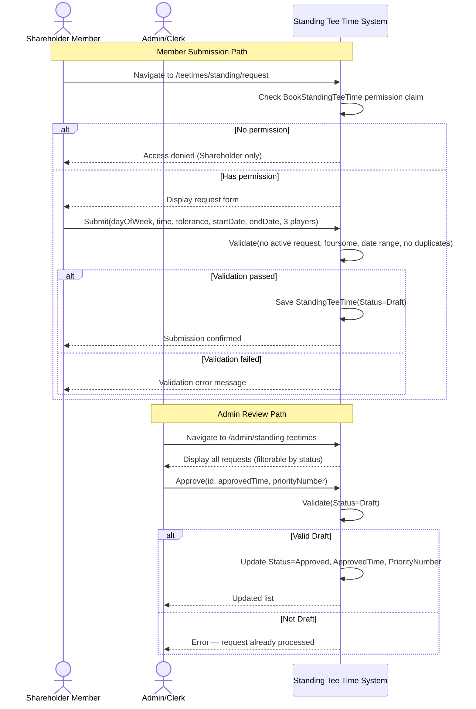

# UC-TT-04 – Manage Standing Tee Time Requests

## Goal / Brief Description
Allow a Shareholder member to submit a recurring standing tee time request for a fixed foursome slot on a specified day of the week across a date range, and allow Admin/Clerk to review and approve or deny those requests.

## Primary Actor
- Shareholder Member

## Supporting Actors
- Admin/Clerk

## Trigger
- Member navigates to the standing tee time request form and submits a new request.
- Admin/Clerk opens the standing tee time management console to review pending Draft requests.

## Preconditions
1. Member is authenticated and holds the `BookStandingTeeTime` permission claim (Shareholder members only).
2. Member has no existing active (non-cancelled, non-denied) standing tee time request.
3. Member has a linked `MemberShipInfo` account in the system.

## Postconditions

### Success (Member Submission)
1. A `StandingTeeTime` record is persisted with `Status = Draft`.
2. The booking member and 3 additional participants are linked to the request.
3. The request is visible in the Admin standing tee time console for review.
4. Member sees a confirmation and can view the request in "My Standing Requests."

### Success (Admin Approval)
1. Request status is updated to `Approved`.
2. Approved tee time and optional priority number are stored on the record.
3. Request is visible to the member as Approved.

### Failure
1. Request is not stored (submission) or not changed (approval/denial).
2. Validation or policy conflict is returned to the actor.

## Main Success Flow — Member Submission

1. Member navigates to `/teetimes/standing/request`.
2. System verifies the `BookStandingTeeTime` permission claim; if missing, displays an access-denied message and stops.
3. System displays the member's name and membership number as the booking member (read-only).
4. System displays the request form: Day of Week, Requested Time, Tolerance (±minutes), Start Date, End Date, and 3 additional player dropdowns.
5. Member selects a day of week, enters a requested time, optionally adjusts tolerance, sets start/end dates, and selects 3 additional players from the member list.
6. Member submits the form.
7. System validates: no existing active request, exactly 3 distinct additional players, end date after start date, booking member not in additional player list.
8. System persists the `StandingTeeTime` with `Status = Draft` and displays a success confirmation.

## Main Success Flow — Admin Approval

1. Admin navigates to `/admin/standing-teetimes`.
2. System displays all standing tee time requests, filterable by status.
3. Admin identifies a `Draft` request and clicks **Approve**.
4. System displays an inline approval form: Approved Time (required) and Priority Number (optional).
5. Admin enters the approved tee time, optionally sets a priority, and confirms.
6. System validates the approved time, updates the record to `Status = Approved`, stores `ApprovedTime` and `PriorityNumber`, and refreshes the list.

## Alternate Flows

### A1 – No Permission (Shareholder Claim Missing)
- At step 2 of the member flow, the `BookStandingTeeTime` claim is not present.
- System displays a message explaining that the feature is available to Shareholder members only.
- Member is not shown the request form.

### A2 – Member Already Has Active Request
- At step 7, the member already has a `Draft`, `Approved`, `Allocated`, or `Unallocated` request.
- System returns an error message indicating the member already has an active standing tee time request.
- No record is created.

### A3 – Invalid Player Selection (Duplicate or Missing)
- At step 7, fewer than 3 distinct players are selected, a player appears twice, or the booking member is selected as an additional player.
- System returns a specific validation error.
- No record is created.

### A4 – Admin Denies Request
- At step 3 of the admin flow, Admin clicks **Deny** instead of **Approve**.
- System prompts confirmation ("Deny this request?").
- Admin confirms.
- System sets `Status = Denied` and refreshes the list.
- Member sees the request as Denied in "My Standing Requests."

### A5 – Member Cancels Own Request
- Member navigates to `/teetimes/standing/my`.
- Member locates a non-terminal request (Draft, Approved, Allocated, or Unallocated) and clicks **Cancel Request**.
- System prompts confirmation.
- Member confirms.
- System calls `CancelAsync` with `requestingMemberId`; sets `Status = Cancelled`.

## Exceptions
- **E1: System Unavailable** — Save or load operation fails; system logs the error and shows a generic retry message. No partial state is committed.

## Business Rules / Notes

1. Only Shareholder members may submit standing tee time requests. Access is controlled by the `BookStandingTeeTime` permission claim; the service does not independently validate membership level.
2. A standing tee time request requires exactly 4 players: the booking Shareholder plus 3 additional members.
3. The requested time includes a ±tolerance window (default ±30 minutes, configurable to 0, ±15, ±30, or ±60 minutes). Staff may approve a time within that window.
4. A member may hold at most one active request at a time. Cancelled and denied requests do not count against this limit, so a member may resubmit after a previous request concludes.
5. Staff assigns a priority number to handle conflicts when multiple approved requests target overlapping slots; lower or higher priority (convention TBD) determines tee-sheet placement.
6. **Requirements gap — ApprovedBy / ApprovedDate:** `BusinessProblem.md` lists "Approved By" (staff name) and "Approved Date" (approval timestamp) as required fields in the physical standing tee time request card's staff-shaded area. These fields are **not yet stored** in the `StandingTeeTime` entity or `StandingTeeTimeService.ApproveAsync`. They are deferred to a future iteration.
7. **Allocation to tee sheet is deferred.** The `Allocated` and `Unallocated` status values are modeled but the logic to auto-generate weekly `TeeTimeBooking` records from an approved request has not been implemented. The tee-sheet integration workflow (clerk processes standing requests one week in advance, then fills remaining slots with phone requests) remains a manual process.
8. **Priority-based conflict detection is deferred.** When two approved requests target the same day/time within tolerance, priority resolution is not yet automated.

## Related Documentation
- Class model: [`06-class-model/standing-tee-time-class.md`](../06-class-model/standing-tee-time-class.md)
- Service: [`07-services/standing-tee-time-service.md`](../07-services/standing-tee-time-service.md)
- Test plan: [`09-testing/standing-tee-time-test-plan.md`](../09-testing/standing-tee-time-test-plan.md)

## System Sequence Diagram

