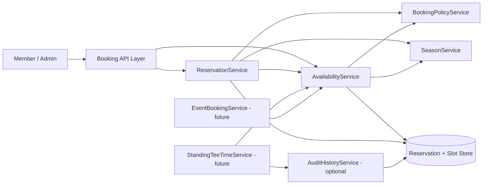

# Tee Time Reservations – Service Architecture and Delivery Order

## Purpose
Define a simple, scalable backend service design that supports immediate reservation needs and planned future capabilities (standing tee times, event bookings, dynamic season changes).

## Service Inventory (Current + Future)

### Core (Build First)
1. **ReservationService**
   - Reservation lifecycle: create, view, update, cancel.
   - Persists reservation + individual player details.
   - Triggers slot occupancy changes.

2. **AvailabilityService**
   - Calculates bookable start times and remaining capacity.
   - Enforces absolute slot cap of 4 total players.
   - Aggregates constraints from reservations, season, policies, and future blockers.

3. **BookingPolicyService**
   - Central booking validations:
     - active member requirement
     - membership-type time-of-day rules (based on booking member)
     - per-request rule checks (e.g., player counts)

4. **SeasonService**
   - Source of truth for bookable season windows.
   - Supports weather-driven season updates.

### Future (Planned Extensions)
5. **StandingTeeTimeService**
   - Manages recurring/standing request lifecycle and assignments.
   - Publishes standing allocations as slot constraints consumed by AvailabilityService.

6. **EventBookingService**
   - Manages tournaments and special events.
   - Publishes event blocks/reductions consumed by AvailabilityService.

7. **AuditHistoryService** *(optional, standing tee times only)*
   - Keep out of initial core reservation scope to reduce complexity.
   - If introduced, prioritize standing tee-time decisions/assignments before broader audit coverage.

## Interaction Design

