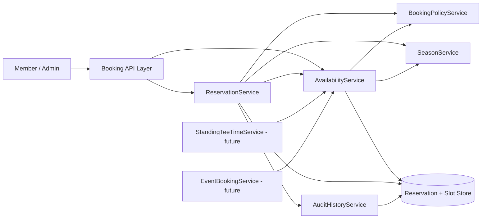

# Tee Time Reservations – Service Architecture and Delivery Order

## Purpose
Define a simple, scalable backend service design that supports immediate reservation needs and planned future capabilities (standing tee times, event bookings, dynamic season changes).

## Service Inventory (Current + Future)

### Core (Build First)
1. **ReservationService**
   - Reservation lifecycle: create, view, update, cancel.
   - Persists reservation + individual player details.
   - Triggers slot occupancy changes.

2. **AvailabilityService**
   - Calculates bookable start times and remaining capacity.
   - Enforces absolute slot cap of 4 total players.
   - Aggregates constraints from reservations, season, policies, and future blockers.

3. **BookingPolicyService**
   - Central booking validations:
     - active member requirement
     - membership-type time-of-day rules (based on booking member)
     - per-request rule checks (e.g., player counts)

4. **SeasonService**
   - Source of truth for bookable season windows.
   - Supports weather-driven season updates.

### Future (Planned Extensions)
5. **StandingTeeTimeService**
   - Manages recurring/standing request lifecycle and assignments.
   - Publishes standing allocations as slot constraints consumed by AvailabilityService.

6. **EventBookingService**
   - Manages tournaments and special events.
   - Publishes event blocks/reductions consumed by AvailabilityService.

7. **AuditHistoryService**
   - Captures who changed what/when for reservation and schedule operations.
   - Supports traceability for staff-assisted and conflict scenarios.

## Interaction Design

## Key Design Rules
1. Slot capacity of 4 players is absolute and never exceeded.
2. Multiple independent bookings may share a start time if capacity remains.
3. Membership time restrictions are checked against the booking member.
4. Booking window is season-based and controlled by SeasonService.
5. Standing tee times and event bookings influence availability through AvailabilityService, not direct reservation bypass.

## Recommended Delivery / Implementation Order

### Phase 1 – Foundations
1. **SeasonService** with configurable season windows.
2. **BookingPolicyService** with member status and membership-time rules.
3. **AvailabilityService** with slot capacity calculation (reservations only).

### Phase 2 – Core Reservation Lifecycle
4. **ReservationService** create/view/update/cancel with atomic occupancy updates.
5. Integrate **AuditHistoryService** for change tracking.

### Phase 3 – Planning Extensions
6. Add **StandingTeeTimeService** and feed allocations into AvailabilityService.
7. Add **EventBookingService** and feed event blocks into AvailabilityService.

### Why this order
- Delivers value early (members can book/manage reservations first).
- Reduces rework by centralizing rules and availability before adding advanced scheduling sources.
- Keeps future capabilities additive rather than disruptive.

## Design Notes for Implementation Discussions
- Prefer explicit interfaces per service to allow isolated testing.
- Keep availability computation deterministic and idempotent.
- Use transactional or equivalent consistency controls for slot occupancy updates.
