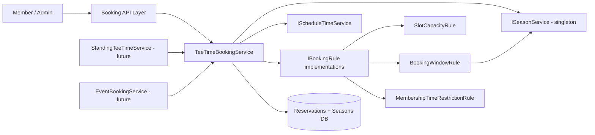

# Tee Time Reservations – Service Architecture and Delivery Order

## Purpose
Define the backend service design for tee-time reservations, covering immediate reservation needs and planned future capabilities (standing tee times, event bookings, dynamic season changes).

## Service Inventory (Current + Future)

### Core (Implemented)

1. **TeeTimeBookingService** *(generic on `TKey`)*
   - Unified service handling both availability queries and reservation lifecycle (create, view by date/member, update players, cancel).
   - Fetches tee times from `IScheduleTimeService`.
   - Applies all `IBookingRule` implementations to each slot/booking request.
   - Occupancy is computed from active `Reservation` records (no separate occupancy table).
   - Batches occupancy queries for range availability to avoid N×M DB queries.
   - Wraps create/update operations in serializable transactions.

2. **IScheduleTimeService / DefaultScheduleTimeService**
   - Generates the ordered list of tee-time slots for a given date.
   - Default implementation: 7.5-minute intervals (alternating 7/8 min), 7:00 AM – 7:00 PM.
   - Interface allows swapping in a different schedule (seasonal hours, day-specific cadences) without touching the booking service.

3. **IBookingRule**
   - Common interface for all booking policies.
   - Each rule receives a `TeeTimeSlot` and a `BookingEvaluationContext` (pre-fetched member category, optional precomputed occupancy, optional excluded reservation ID).
   - Returns an `int`: remaining capacity after the request. Negative = denied; 0 = exactly full (accepted); positive = capacity remaining.
   - Implemented rules:
     - **SlotCapacityRule** – enforces the 4-player slot cap.
     - **BookingWindowRule** – requires the slot date to fall within an active or planned season (via `ISeasonService`).
     - **MembershipTimeRestrictionRule** – enforces Gold/Silver/Bronze time-of-day restrictions.

4. **ISeasonService / SeasonService**
   - Singleton service loaded once at application startup.
   - Holds all `Active` and `Planned` seasons, enabling advance booking into upcoming seasons.
   - Exposes `GetSeasonForDate(DateOnly)` for in-memory lookup with no per-request DB queries.
   - Restart the application to pick up season data changes.

### Future (Planned Extensions)

5. **StandingTeeTimeService**
   - Manages recurring/standing request lifecycle and assignments.
   - Would supply slot constraints consumed by `TeeTimeBookingService`.

6. **EventBookingService**
   - Manages tournaments and special events.
   - Would supply event blocks consumed by `TeeTimeBookingService` (e.g., a dedicated `EventBlockRule`).

7. **AuditHistoryService** *(optional)*
   - Keep out of initial core scope.
   - Prioritize for standing tee-time decisions/assignments if introduced.

## Interaction Design

## Domain Model Shape (Phase 1)

- `Reservation` – booking entity. `PlayerMemberAccountIds` holds the **additional (non-booking) players** only; the booking member is always implicit player #1. `IsCancelled` bool replaces a status enum.
- `TeeTimeSlot` – input record shared between booking requests and rule evaluation.
- `Season` – persisted with `SeasonStatus` (`Planned | Active | Closed`). Active + Planned seasons are loaded into `SeasonService` at startup.
- No separate `SlotOccupancy` table – occupancy is computed from active reservations at query time and batched for range queries.
- Domain validation and orchestration are executed in `TeeTimeBookingService` and `IBookingRule` implementations rather than on domain model instance methods.
