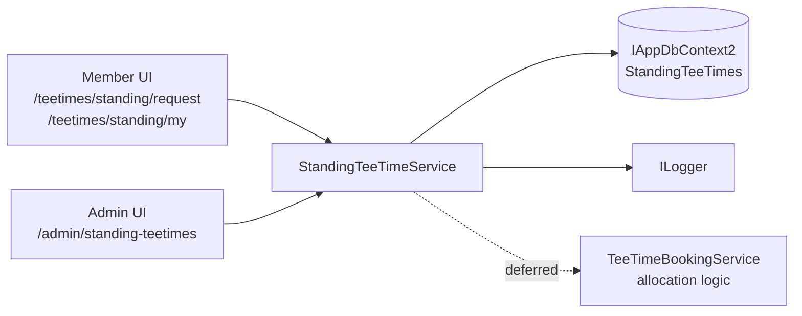

# StandingTeeTimeService (Application Service)

## Purpose
Manage the full lifecycle of standing tee time requests: member submission, admin approval or denial, member cancellation, and read access for both members and admins.

## Current Scope (v1)
- Submit a new standing tee time request (member).
- Retrieve all requests for admin review.
- Retrieve requests belonging to a specific member.
- Approve a Draft request (admin), recording the approved tee time and optional priority.
- Deny a Draft request (admin).
- Cancel an active request (member — own requests only).

## Responsibilities
- Enforce the one-active-request-per-member constraint on submission.
- Validate foursome composition (exactly 3 additional participants, no duplicates, booking member not in participant list).
- Validate date range (`EndDate > StartDate`).
- Enforce status transition rules (only `Draft` requests can be approved or denied).
- Enforce ownership on cancellation (a member may only cancel their own requests).
- Log warnings for not-found and invalid-status rejections in `ApproveAsync`, `DenyAsync`, `CancelAsync`, and the duplicate-active-request guard in `SubmitRequestAsync`; local validation failures (participant count, date range, duplicates) return error messages without logging.

## Core Operations

### GetAllAsync
```csharp
Task<IReadOnlyList<StandingTeeTime>> GetAllAsync()
```
**Inputs:** None.
**Output:** All standing tee time requests ordered by `Id` descending (newest first). Read-only, no-tracking query.

---

### GetForMemberAsync
```csharp
Task<IReadOnlyList<StandingTeeTime>> GetForMemberAsync(int memberId)
```
**Inputs:** `memberId` — the member's `MemberShipInfo.Id`.
**Output:** All standing tee time requests for that member, ordered by `Id` descending. Read-only, no-tracking query.

---

### SubmitRequestAsync
```csharp
Task<(bool Success, string? ErrorMessage)> SubmitRequestAsync(StandingTeeTime request)
```
**Inputs:** A `StandingTeeTime` instance with `BookingMemberId`, `AdditionalParticipants`, `RequestedDayOfWeek`, `RequestedTime`, `ToleranceMinutes`, `StartDate`, `EndDate`.

**Output:** `(Success: true, ErrorMessage: null)` on success. `(Success: false, ErrorMessage: <reason>)` on any validation failure or save failure.

**Validation order (local checks first, DB check last):**
1. `AdditionalParticipants.Count != 3` → reject.
2. `EndDate <= StartDate` → reject.
3. Booking member appears in participant list → reject.
4. Duplicate members in participant list → reject.
5. Member already has an active (non-cancelled, non-denied) request → reject (DB query).

---

### ApproveAsync
```csharp
Task<bool> ApproveAsync(int id, TimeOnly approvedTime, int? priorityNumber)
```
**Inputs:** `id` of the standing request, `approvedTime` (the confirmed slot time), optional `priorityNumber` where, if provided, the value must be `>= 1`.

**Output:** `true` on success; `false` if not found, not in `Draft` status, or `priorityNumber` is provided with a value less than `1`.

**Side effects:** Sets `Status = Approved`, `ApprovedTime`, and `PriorityNumber` on the persisted record.

---

### DenyAsync
```csharp
Task<bool> DenyAsync(int id)
```
**Inputs:** `id` of the standing request.

**Output:** `true` on success; `false` if not found or not in `Draft` status.

**Side effects:** Sets `Status = Denied`.

---

### CancelAsync
```csharp
Task<bool> CancelAsync(int id, int requestingMemberId)
```
**Inputs:** `id` of the standing request, `requestingMemberId` — the member attempting the cancellation.

**Output:** `true` on success; `false` if not found, wrong owner, or already in a terminal status (`Cancelled` or `Denied`).

**Side effects:** Sets `Status = Cancelled`.

## Invariants / Rules (v1)

- A member may have at most one active (non-`Cancelled`, non-`Denied`) standing tee time request at any time.
- Exactly 3 `AdditionalParticipants` are required; the total party must be a foursome.
- `EndDate` must be strictly after `StartDate`.
- No duplicate `MemberShipInfo` entries in `AdditionalParticipants`.
- The booking member cannot also appear as an additional participant.
- Only requests in `Draft` status may be approved or denied.
- A member may only cancel their own requests; admins bypass this via direct status management (not via this service method).
- Requests already in `Cancelled` or `Denied` cannot be cancelled again.

## Deferred / Future

- **Allocation logic** — after a request is approved, generate individual `TeeTimeBooking` records for each matching date in the `StartDate`–`EndDate` range that falls on `RequestedDayOfWeek`. Set status to `Allocated` or `Unallocated` accordingly.
- **Conflict detection** — when two approved requests target the same day/time (within tolerance), use `PriorityNumber` to determine which request is accommodated.
- **Tee sheet integration** — the clerk workflow of processing standing requests one week in advance before phone requests is not yet automated.
- **ApprovedBy / ApprovedDate** — the business problem specifies that staff approval records the approving clerk and the approval date; these fields are not yet stored.
- **One-active-request race condition** — the duplicate-request guard in `SubmitRequestAsync` is an `AnyAsync` read followed by an insert; two concurrent submissions from the same member could both pass the check. A filtered unique index on `(BookingMemberId)` where `Status NOT IN (Cancelled, Denied)` would enforce the invariant at the database level.

## Explicit Non-Rules

- This service does **not** validate that `BookingMember` holds a Shareholder membership level. Shareholder-only access is enforced at the UI and authorization layer via the `BookStandingTeeTime` permission claim (`AppRoles.Permissions.BookStandingTeeTime`).
- This service does **not** interact with `TeeTimeBookingService` or generate bookings. That integration is deferred.

## Suggested Dependencies
- `IAppDbContext2` — data access contract
- `ILogger<StandingTeeTimeService>` — structured logging for warnings and audit events

## Service Context Diagram


