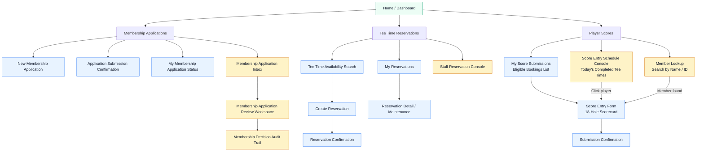
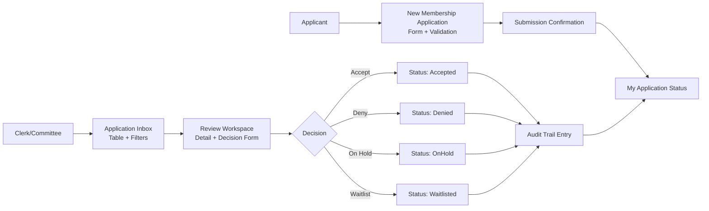
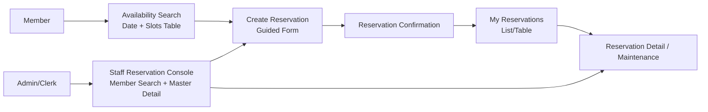

# Proposed UI Design Diagrams (Low-Fidelity)

These diagrams are intentionally low-fidelity and are meant to support planning conversations before implementation.

## 1) Site Map and Role-Based Navigation



## 2) Membership Application Flow (Applicant + Committee)



## 3) Tee-Time Reservation Flow (Member + Staff)



## 4) Wireframe – Membership Application Inbox

```text
+--------------------------------------------------------------------------------+
| Membership Application Inbox                                                   |
+--------------------------------------------------------------------------------+
| Filters: [Status v] [Review Cycle v] [Date Range] [Search Applicant......]    |
| Actions: [Export] [Assign Reviewer]                                            |
+--------------------------------------------------------------------------------+
| #   Applicant Name      Category   Submitted On   Status      Reviewer         |
| 42  Alex Rivers         Family     2026-03-02     Submitted   Unassigned       |
| 41  Priya Das           Individual 2026-03-01     OnHold      J. Lee           |
| 40  Morgan Smith        Family     2026-02-28     Waitlisted  K. Patel         |
+--------------------------------------------------------------------------------+
| [Open Selected] [Refresh]                                                      |
+--------------------------------------------------------------------------------+
```

## 5) Wireframe – Membership Review Workspace

```text
+--------------------------------------------------------------------------------+
| Membership Application Review Workspace                                         |
+-------------------------------------+------------------------------------------+
| Application Detail (read-only)      | Decision Panel                           |
| - Applicant profile                 | Decision: ( ) Accept ( ) Deny            |
| - Sponsor details                   |           ( ) OnHold ( ) Waitlist        |
| - Declarations / consents           | Rationale: [...........................]  |
| - Validation flags                  | Internal note: [.......................] |
|                                     | [Save Note] [Submit Decision]            |
+-------------------------------------+------------------------------------------+
| Status History / Audit Timeline                                                |
| - Submitted by applicant (date/time)                                            |
| - Assigned to reviewer (date/time)                                              |
| - Previous decision notes...                                                    |
+--------------------------------------------------------------------------------+
```

## 6) Wireframe – Tee-Time Availability + Booking

```text
+--------------------------------------------------------------------------------+
| Tee Time Availability Search                                                    |
+--------------------------------------------------------------------------------+
| Date: [2026-05-18]  Players: [2]  Time Window: [Morning v]  [Search Slots]     |
+--------------------------------------------------------------------------------+
| Tee Time   Capacity   Booked   Open Spots   Restrictions                        |
| 07:30      4          2        2           Member only                          |
| 07:40      4          4        0           Full                                 |
| 07:50      4          1        3           -                                    |
+--------------------------------------------------------------------------------+
| [Select Slot] -> opens Create Reservation form                                  |
+--------------------------------------------------------------------------------+

+--------------------------------------------------------------------------------+
| Create Reservation (selected slot: 07:50)                                       |
+--------------------------------------------------------------------------------+
| Booking Member: [Current User v]                                                |
| Additional Players: [Name] [Name] [Add Player]                                  |
| Policy Checks: ✔ within season  ✔ within booking window                         |
| [Confirm Reservation] [Cancel]                                                  |
+--------------------------------------------------------------------------------+
```
