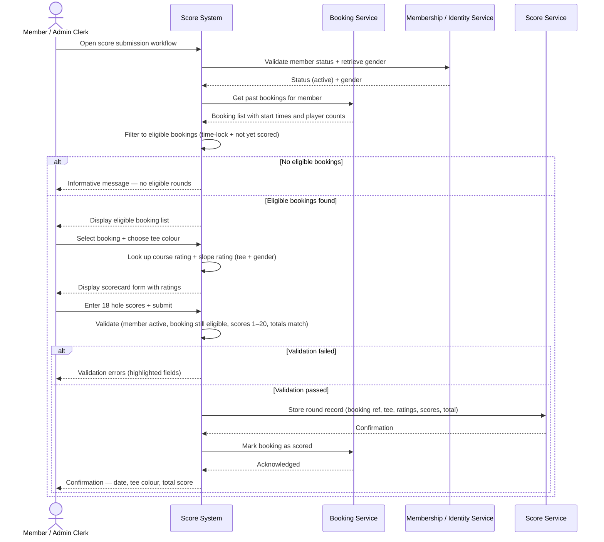

# UC-PS-01 – Record Player Score

## Goal / Brief Description

Allow an active member (or authorized staff acting on behalf of a member) to record a completed 18-hole round at Club BAIST by selecting an eligible past tee time booking and entering hole-by-hole scores, while enforcing booking eligibility, minimum round-completion time, and score data integrity rules.

## Primary Actor

- Member

## Supporting Actors

- Admin / Clerk (staff-assisted alternate flow)
- Booking Service (tee time booking history and eligibility)
- Membership / Identity Service (member status and gender)
- Score Service (score storage)

## Trigger

- Member (or clerk on their behalf) initiates a score submission for a completed round of golf.

## Preconditions

1. Member exists and is active / in good standing.
2. Member has at least one past tee time booking for which the minimum round-completion window has elapsed and no score has yet been recorded.

## Postconditions

### Success

1. A round record is stored, linked to the selected tee time booking.
2. The round record captures: tee colour, course rating, slope rating, all 18 hole scores, and calculated total score.
3. The selected booking is marked as scored (preventing duplicate submissions).

### Failure / Partial

1. No round record is created.
2. Eligibility or validation errors are returned to the actor.

## Main Success Flow

1. Member opens the score submission workflow.
2. System retrieves the member's past tee time bookings and filters to those that are **eligible**: booking start time + minimum round-completion duration (based on player count) has elapsed, and no score has been recorded against the booking.
3. System displays the list of eligible bookings for the member to select from (showing date, time, and player count).
4. Member selects the booking they wish to score.
5. System displays the scorecard entry form, pre-populated with the booking date and tee colour options (Red / White / Blue).
6. Member selects tee colour.
7. System looks up and displays the course rating and slope rating for the selected tee colour, using the member's gender on file.
8. Member enters their score for each of the 18 holes.
9. System calculates and displays running totals (Front 9 out, Back 9 in, Total) as the member enters scores.
10. Member reviews the totals and submits the scorecard.
11. System validates the submission (see Business Rules).
12. System stores the round record linked to the booking and marks the booking as scored.
13. System returns a confirmation with a summary: date, tee colour, total score.

## Alternate Flows

### A1 – No Eligible Bookings

- At step 2, the member has no past bookings that satisfy the eligibility criteria (none past the minimum window, or all past bookings have already been scored).
- System displays an informative message explaining that no eligible rounds are available to score at this time.
- Use case ends.

### A2 – Score Validation Failure

- At step 11, one or more hole scores are outside the valid range (less than 1 or greater than 20), or one or more holes are missing.
- System highlights the offending fields and returns a descriptive error.
- Member corrects the entries and resubmits (returns to step 8).

### A3 – Member Not Active

- At step 11, re-validation reveals the member's status has changed to inactive since the form was loaded.
- System rejects the submission and displays the member's current status.
- Use case ends.

### A4 – Booking No Longer Eligible at Submit Time

- At step 11, the selected booking is found to have been scored by a concurrent submission (race condition) or is otherwise no longer eligible.
- System rejects the submission and refreshes the eligible booking list.
- Member selects a different booking or use case ends.

### A5 – Staff-Assisted Score Entry

- Admin / Clerk performs the workflow on behalf of an active member.
- All eligibility and policy checks (member status, booking ownership, minimum round-completion window) are evaluated against the **member account being scored**, not the acting clerk.
- System records the clerk as the acting user in audit metadata alongside the member account.
- Flow otherwise follows the Main Success Flow from step 1.

## Exceptions

- **E1: Duplicate Submission Concurrency**: Two simultaneous submissions for the same booking are received. The second transaction detects the booking is already marked as scored and is rejected with a clear error.
- **E2: Score Service Unavailable**: The score storage operation fails. The submission is rejected and the member is prompted to retry.

## Related Business Rules / Notes

1. **Booking eligibility** is determined by: `DateTime.UtcNow >= booking.TeeTimeSlot.Start + minimumRoundDuration(booking.ParticipantCount)`, where `ParticipantCount = 1 + AdditionalParticipants.Count`.
2. **Minimum round-completion durations** (fast-player baseline):

   | Players in Booking | Minimum Time After Booking Start |
   |--------------------|----------------------------------|
   | 1 | 2 hours |
   | 2 | 2 hours 30 minutes |
   | 3 | 3 hours |
   | 4 | 3 hours 30 minutes |

3. Each tee time booking may have **at most one score record** linked to it. Once scored, a booking no longer appears in the eligible list.
4. **Per-hole score range**: minimum 1, maximum 20 strokes. WHS does not cap recorded gross scores, but values outside this range are treated as data entry errors.
5. **Total score** is calculated by the system as the sum of all 18 hole scores. It is never entered manually.
6. **Course and slope ratings** are looked up from the Club BAIST course table using the member's tee colour selection and their gender on file. The member cannot manually override these values.
7. Only **Club BAIST rounds** tied to tee time bookings are in scope for this use case. Rounds at external Golf Canada-approved courses are deferred (UC-PS-02).
8. Only **full 18-hole rounds** are in scope. Abbreviated 9-hole rounds are deferred (UC-PS-05).
9. **Handicap Index calculation** is not triggered by this use case. Score data is stored; handicap computation is a separate use case (UC-PS-03).
10. **Attestation** (WHS marker/signing requirement) is deferred and out of scope for this use case. The submitting member's authenticated identity is the only attestation recorded at this stage.
11. The eligibility list shown in step 3 includes **only bookings where the member is the booking member** (primary booker), not bookings where they appear as an additional participant. Scoring for additional participants is deferred.
12. Authorization: only members with an active membership account, or Admin / Clerk staff, may access this workflow.

## Initial SSD (System Sequence Diagram)

