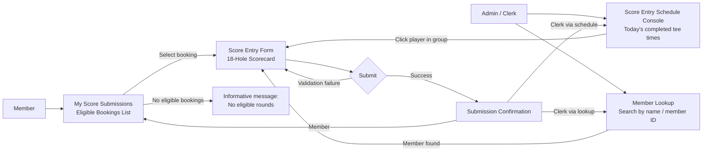

# Player Scores – UI Design (Low-Fidelity)

These diagrams are intentionally low-fidelity. They exist to support planning conversations before implementation. Detailed visual design is out of scope.

---

## B2 — Score Submission Flow (Member + Clerk Paths)



**Notes:**
- Clerk primary path: schedule view of today's completed tee time groups — click an individual player to open score entry for that player.
- Clerk secondary path: member lookup (search by name or member ID) navigates directly to score entry for that member.
- Member path: their own eligible bookings list, same as before.
- All eligibility and policy checks evaluate against the **member being scored**, not the acting clerk.
- Validation failure returns to the form with fields highlighted — no page navigation.

---

## B3 — Wireframe: My Score Submissions (Member View — Eligible Bookings List)

```text
+--------------------------------------------------------------------------------+
| My Score Submissions                                                           |
+--------------------------------------------------------------------------------+
| Eligible rounds available to score:                                            |
+--------------------------------------------------------------------------------+
|  Date         Time    Players                                                  |
|  2026-05-18   07:50   4                                                        |
|  2026-05-10   10:20   2                                                        |
+--------------------------------------------------------------------------------+
|  [Enter Scores →]                                                              |
+--------------------------------------------------------------------------------+

+--------------------------------------------------------------------------------+
| Past Submitted Rounds                                                          |
+--------------------------------------------------------------------------------+
|  Date         Tee     Total Score   Submitted On                               |
|  2026-04-30   White   87            2026-04-30 14:32                           |
|  2026-04-15   Blue    92            2026-04-15 16:10                           |
+--------------------------------------------------------------------------------+
```

**Notes:**
- Two sections on one page: eligible (actionable) and already-submitted (read-only history).
- "No eligible rounds" message replaces the eligible table when none exist.
- Clicking a row in the eligible section opens the Score Entry Form for that booking.

---

## B3b — Wireframe: Score Entry Schedule Console (Clerk Primary View)

Uses a **`QuickGrid`** table — the same component used in `StaffConsole.razor` for the tee time reservations view. One row per eligible booking, no custom grouping.

```text
+--------------------------------------------------------------------------------+
| Score Entry Console — May 18, 2026                                            |
+--------------------------------------------------------------------------------+
| [Search Member: ________________] [Go]     (secondary path — member lookup)   |
+--------------------------------------------------------------------------------+
| QuickGrid — sortable columns                                                   |
+----------+------------------+--------+-----------+----------------------------+
| Time     | Booking Member   | Players| Status    | Action                     |
+----------+------------------+--------+-----------+----------------------------+
| 07:30 AM | Smith, Jordan    | 4      | Eligible  | [Record Score]             |
| 07:50 AM | Chen, Wei        | 2      | Scored ✓  | —                          |
| 08:10 AM | Okafor, Emeka    | 3      | Eligible  | [Record Score]             |
| 09:00 AM | Torres, Marco    | 1      | Time-lock | — (greyed out)             |
+----------+------------------+--------+-----------+----------------------------+
```

**Notes:**
- `QuickGrid` with `TemplateColumn` entries — matches the pattern in `StaffConsole.razor` (`<QuickGrid Items="..." Class="table table-striped table-hover">`).
- Only the booking member (primary booker) is shown per row. UC-PS-01 rule 11 scopes submission to primary bookers only; additional participants are not shown to avoid a dead-end path.
- **Status** values: `Eligible` (time-lock elapsed, no score yet) / `Scored ✓` (score already recorded — action disabled) / `Time-lock` (minimum elapsed time not yet reached — action disabled and row greyed out).
- **[Record Score]** button navigates to the Score Entry Form (B4) for that booking.
- The member search bar at the top is the **secondary** path — searching and selecting a member navigates directly to their Score Entry Form regardless of today's schedule.
- Default sort: `Time` ascending (earliest first). Clerk can click column headers to re-sort.

---

## B4 — Wireframe: Score Entry Form (18-Hole Scorecard)

```text
+--------------------------------------------------------------------------------+
| Record Score — May 18, 2026, 07:30                                             |
| Member: Smith, Jordan  ·  Group of 4                                           |
+--------------------------------------------------------------------------------+
| Tee Colour:  ( ) Red   (•) White   ( ) Blue                                   |
+--------------------------------------------------------------------------------+
| Hole  |  1 |  2 |  3 |  4 |  5 |  6 |  7 |  8 |  9 | 10 | 11 | 12 | 13 | 14 | 15 | 16 | 17 | 18 | TOTAL |
+-------+----+----+----+----+----+----+----+----+----+----+----+----+----+----+----+----+----+----+-------+
| Par   |  4 |  5 |  3 |  4 |  4 |  4 |  4 |  5 |  4 |  4 |  4 |  3 |  5 |  4 |  4 |  3 |  5 |  4 |   73  |
| Score |[__]|[__]|[__]|[__]|[__]|[__]|[__]|[__]|[__]|[__]|[__]|[__]|[__]|[__]|[__]|[__]|[__]|[__]|   —   |
+-------+----+----+----+----+----+----+----+----+----+----+----+----+----+----+----+----+----+----+-------+

| TOTAL updates live as scores are entered. Displayed once all 18 holes are filled. |
|                                                                                    |
| [Submit Scorecard]   [Cancel]                                                      |
+------------------------------------------------------------------------------------+
```

**Notes:**
- Single continuous row for all 18 holes — no front/back 9 grouping.
- Par row is display-only (sourced from Club BAIST scorecard; no user input).
- Score cells: numeric input, min 1, max 20. Validated on blur and on submit.
- TOTAL = sum of all 18 hole scores, calculated by the system. Updates live as holes are filled.
- Submit is disabled until all 18 holes have a value.
- Member name and group size shown in the header when accessed via the Clerk console.

---

## B5 — Wireframe: Submission Confirmation

```text
+--------------------------------------------------------------------------------+
| Score Submitted                                                                 |
+--------------------------------------------------------------------------------+
|                                                                                 |
|   Round recorded successfully.                                                  |
|                                                                                 |
|   Member:        Smith, Jordan          (shown for clerk; hidden for member)   |
|   Date:          May 18, 2026                                                  |
|   Tee Colour:    White                                                          |
|   Total Score:   87                                                             |
|                                                                                 |
|   [Return to My Score Submissions]            (member)                         |
|   [Return to Score Entry Console]             (clerk via schedule)             |
|   [Search Another Member]                     (clerk via member lookup)        |
|                                                                                 |
+--------------------------------------------------------------------------------+
```

**Notes:**
- No edit capability from this page — score is final once submitted.
- Member sees their own confirmation without the "Member:" label or clerk return links.
- Clerk return action depends on entry path: schedule console or member lookup.
- After returning to the schedule console, the submitted player now shows as `Name ✓`.
