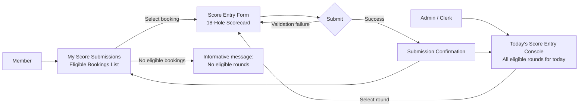

# Player Scores – UI Design (Low-Fidelity)

These diagrams are intentionally low-fidelity. They exist to support planning conversations before implementation. Detailed visual design is out of scope.

---

## B2 — Score Submission Flow (Member + Clerk Paths)



**Notes:**
- Clerk path enters via a day-level view of all eligible rounds — no member-search step.
- Member path enters via their own eligible bookings list.
- All eligibility and policy checks evaluate against the **member being scored**, not the acting clerk.
- Validation failure returns to the form with fields highlighted — no page navigation.
- After confirmation, clerk returns to Today's Score Entry Console; member returns to their list.

---

## B3 — Wireframe: My Score Submissions (Member View — Eligible Bookings List)

```text
+--------------------------------------------------------------------------------+
| My Score Submissions                                                           |
+--------------------------------------------------------------------------------+
| Eligible rounds available to score:                                            |
+--------------------------------------------------------------------------------+
|  Date         Time    Players                                                  |
|  2026-05-18   07:50   4                                                        |
|  2026-05-10   10:20   2                                                        |
+--------------------------------------------------------------------------------+
|  [Enter Scores →]                                                              |
+--------------------------------------------------------------------------------+

+--------------------------------------------------------------------------------+
| Past Submitted Rounds                                                          |
+--------------------------------------------------------------------------------+
|  Date         Tee     Total Score   Submitted On                               |
|  2026-04-30   White   87            2026-04-30 14:32                           |
|  2026-04-15   Blue    92            2026-04-15 16:10                           |
+--------------------------------------------------------------------------------+
```

**Notes:**
- Two sections on one page: eligible (actionable) and already-submitted (read-only history).
- "No eligible rounds" message replaces the eligible table when none exist.
- Clicking a row in the eligible section opens the Score Entry Form for that booking.

---

## B3b — Wireframe: Today's Score Entry Console (Clerk View)

```text
+--------------------------------------------------------------------------------+
| Today's Score Entry — May 18, 2026                                            |
+--------------------------------------------------------------------------------+
| Rounds eligible for score entry (time-lock elapsed, not yet scored):           |
+--------------------------------------------------------------------------------+
|  Member            Tee Time   Players   Status                                 |
|  Smith, Jordan     07:30      4         Awaiting score                         |
|  Das, Priya        07:50      2         Awaiting score                         |
|  Rivers, Alex      08:10      3         Awaiting score                         |
|  Patel, Kim        09:00      1         Score entered ✓                        |
+--------------------------------------------------------------------------------+
|  [Enter Scores for Selected Member →]                                          |
+--------------------------------------------------------------------------------+
```

**Notes:**
- Shows all tee time bookings from today where the time-lock has elapsed.
- Already-scored bookings appear in the list as "Score entered ✓" (read-only, not selectable).
- Bookings not yet past the time-lock do not appear.
- Clerk selects a row and proceeds directly to the Score Entry Form — no separate member search step.
- Score Entry Form header shows the member's name prominently when accessed via this console.

---

## B4 — Wireframe: Score Entry Form (18-Hole Scorecard)

```text
+--------------------------------------------------------------------------------+
| Record Score — May 18, 2026, 07:50                                             |
| Member: Das, Priya  ·  2 Players                                               |
+--------------------------------------------------------------------------------+
| Tee Colour:  ( ) Red   (•) White   ( ) Blue                                   |
+--------------------------------------------------------------------------------+
| Hole  |  1 |  2 |  3 |  4 |  5 |  6 |  7 |  8 |  9 | 10 | 11 | 12 | 13 | 14 | 15 | 16 | 17 | 18 | TOTAL |
+-------+----+----+----+----+----+----+----+----+----+----+----+----+----+----+----+----+----+----+-------+
| Par   |  4 |  5 |  3 |  4 |  4 |  4 |  4 |  5 |  4 |  4 |  4 |  3 |  5 |  4 |  4 |  3 |  5 |  4 |   73  |
| Score |[__]|[__]|[__]|[__]|[__]|[__]|[__]|[__]|[__]|[__]|[__]|[__]|[__]|[__]|[__]|[__]|[__]|[__]|   —   |
+-------+----+----+----+----+----+----+----+----+----+----+----+----+----+----+----+----+----+----+-------+

| TOTAL updates live as scores are entered. Displayed once all 18 holes are filled. |
|                                                                                    |
| [Submit Scorecard]   [Cancel]                                                      |
+------------------------------------------------------------------------------------+
```

**Notes:**
- Single continuous row for all 18 holes — no front/back 9 grouping.
- Par row is display-only (sourced from Club BAIST scorecard; no user input).
- Score cells: numeric input, min 1, max 20. Validated on blur and on submit.
- TOTAL = sum of all 18 hole scores, calculated by the system. Updates live as holes are filled.
- Submit is disabled until all 18 holes have a value.
- Member name shown in the header when accessed via the Clerk console.

---

## B5 — Wireframe: Submission Confirmation

```text
+--------------------------------------------------------------------------------+
| Score Submitted                                                                 |
+--------------------------------------------------------------------------------+
|                                                                                 |
|   Round recorded successfully.                                                  |
|                                                                                 |
|   Member:        Das, Priya             (shown for clerk; hidden for member)   |
|   Date:          May 18, 2026                                                  |
|   Tee Colour:    White                                                          |
|   Total Score:   87                                                             |
|                                                                                 |
|   [Return to My Score Submissions]          (member)                           |
|   [Return to Today's Score Entry Console]   (clerk)                            |
|                                                                                 |
+--------------------------------------------------------------------------------+
```

**Notes:**
- No edit capability from this page — score is final once submitted.
- Member sees their own confirmation without the "Member:" label.
- Clerk sees the member name and returns to the day-level console.
- Submitted booking moves to the "Score entered ✓" row in the clerk console and to Past Submitted Rounds in the member view.
