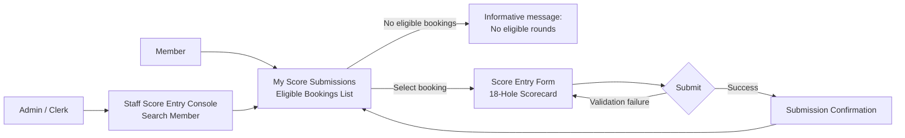

# Player Scores – UI Design (Low-Fidelity)

These diagrams are intentionally low-fidelity. They exist to support planning conversations before implementation. Detailed visual design is out of scope.

---

## B2 — Score Submission Flow (Member + Clerk Paths)



**Notes:**
- Clerk path enters via member search (same pattern as Staff Reservation Console).
- All eligibility and policy checks evaluate against the **member being scored**, not the acting clerk.
- Validation failure returns the member to the form with fields highlighted — no page navigation.

---

## B3 — Wireframe: My Score Submissions (Eligible Bookings List)

```text
+--------------------------------------------------------------------------------+
| My Score Submissions                                                           |
+--------------------------------------------------------------------------------+
| Eligible rounds available to score:                                            |
+--------------------------------------------------------------------------------+
|  Date         Time    Players   Notes                                          |
|  2026-05-18   07:50   4         -                                              |
|  2026-05-10   10:20   2         -                                              |
+----------------------------------+---------------------------------------------+
|  [Enter Scores →]                                                              |
+--------------------------------------------------------------------------------+

+--------------------------------------------------------------------------------+
| Past Submitted Rounds                                                          |
+--------------------------------------------------------------------------------+
|  Date         Tee     Total Score   Submitted On                               |
|  2026-04-30   White   87            2026-04-30 14:32                           |
|  2026-04-15   Blue    92            2026-04-15 16:10                           |
+--------------------------------------------------------------------------------+
```

**Notes:**
- Two sections on one page: eligible (actionable) and already-submitted (read-only history).
- "No eligible rounds" message replaces the eligible table when none exist.
- Clicking a row in the eligible section opens the Score Entry Form for that booking.

---

## B4 — Wireframe: Score Entry Form (18-Hole Scorecard)

```text
+--------------------------------------------------------------------------------+
| Record Score — May 18, 2026, 07:50, 4 Players                                 |
+--------------------------------------------------------------------------------+
| Tee Colour:  ( ) Red   (•) White   ( ) Blue                                   |
+--------------------------------------------------------------------------------+
| FRONT NINE                                                                     |
+-------+----+----+----+----+----+----+----+----+----+--------+                 |
| Hole  |  1 |  2 |  3 |  4 |  5 |  6 |  7 |  8 |  9 |  OUT   |                 |
| Par   |  4 |  5 |  3 |  4 |  4 |  4 |  4 |  5 |  4 |   37   |                 |
| Score |[__]|[__]|[__]|[__]|[__]|[__]|[__]|[__]|[__]|   —    |                 |
+-------+----+----+----+----+----+----+----+----+----+--------+                 |
                                                                                 |
| BACK NINE                                                                      |
+-------+----+----+----+----+----+----+----+----+----+--------+--------+        |
| Hole  | 10 | 11 | 12 | 13 | 14 | 15 | 16 | 17 | 18 |  IN    | TOTAL  |        |
| Par   |  4 |  4 |  3 |  5 |  4 |  4 |  3 |  5 |  4 |   36   |   73   |        |
| Score |[__]|[__]|[__]|[__]|[__]|[__]|[__]|[__]|[__]|   —    |   —    |        |
+-------+----+----+----+----+----+----+----+----+----+--------+--------+        |
                                                                                 |
| OUT and IN totals update as scores are entered.                                |
| TOTAL = OUT + IN, displayed when all 18 holes are filled.                     |
|                                                                                |
| [Submit Scorecard]   [Cancel]                                                  |
+--------------------------------------------------------------------------------+
```

**Notes:**
- Par row is display-only (sourced from Club BAIST scorecard; no user input).
- Score cells: numeric input, min 1, max 20. Validated on blur and on submit.
- OUT updates live after holes 1–9; IN updates live after holes 10–18; TOTAL appears once all 18 are entered.
- Hole 7 par shown as 4 (White/Blue) — tee colour selection does not change the displayed par in MVP; par display is informational only.
- Submit is disabled until all 18 holes have a value.
- Clerk-assisted entry: member name and booking details shown in the header alongside the date/time.

---

## B5 — Wireframe: Submission Confirmation

```text
+--------------------------------------------------------------------------------+
| Score Submitted                                                                 |
+--------------------------------------------------------------------------------+
|                                                                                 |
|   Round recorded successfully.                                                  |
|                                                                                 |
|   Date:         May 18, 2026                                                   |
|   Tee Colour:   White                                                           |
|   Front Nine:   43                                                              |
|   Back Nine:    44                                                              |
|   Total Score:  87                                                              |
|                                                                                 |
|   [Return to My Score Submissions]                                              |
|                                                                                 |
+--------------------------------------------------------------------------------+
```

**Notes:**
- No edit capability from this page — score is final once submitted.
- "Return" link goes back to the Eligible Bookings List, where the submitted booking will now appear in the Past Submitted Rounds section (no longer in the eligible list).
- Clerk-assisted: confirmation displayed to the clerk; member's name shown in the summary header.
