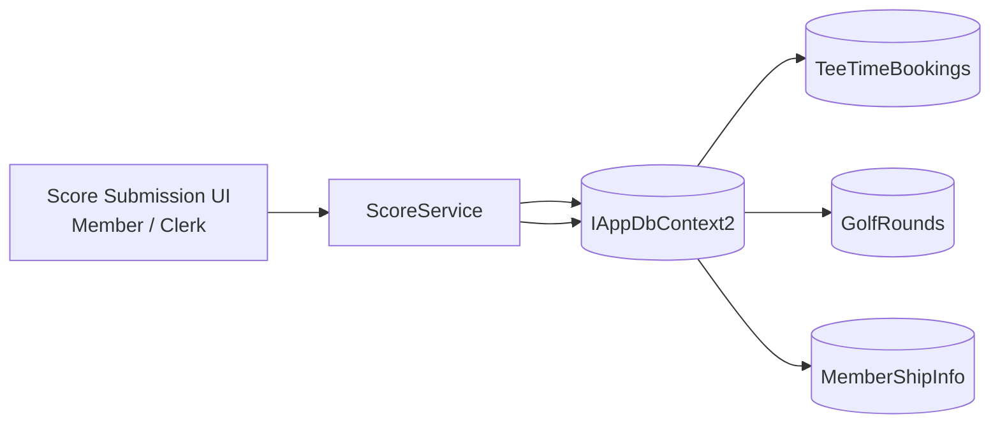

# ScoreService (Application Service)

## Purpose

Coordinate the end-to-end score submission workflow for UC-PS-01. Retrieves eligible bookings for a member, validates and stores a submitted golf round, and supports future reporting by returning a member's round history.

## Current Scope (MVP)

- Return a member's tee time bookings that are eligible for score entry.
- Validate and persist a `GolfRound` in a concurrency-safe transaction.
- Return a member's submitted rounds (read-only; used by both the member list view and the clerk console).

---

## D1 — Method Signatures

```csharp
public class ScoreService
{
    public Task<IReadOnlyList<EligibleBooking>> GetEligibleBookingsAsync(
        int memberId,
        CancellationToken cancellationToken = default);

    public Task<ScoreSubmissionResult> SubmitRoundAsync(
        SubmitRoundRequest request,
        string actingUserId,
        CancellationToken cancellationToken = default);

    public Task<IReadOnlyList<GolfRound>> GetRoundsByMemberAsync(
        int memberId,
        CancellationToken cancellationToken = default);
}
```

### Supporting Types

```csharp
/// <summary>
/// A booking that passes the time-lock and has no existing GolfRound.
/// Returned to the UI for display in the eligible bookings list.
/// </summary>
public record EligibleBooking(
    int BookingId,
    DateTime TeeTimeSlotStart,
    int ParticipantCount);

/// <summary>Request payload for score submission.</summary>
public record SubmitRoundRequest(
    int BookingId,
    int MembershipId,
    GolfRound.TeeColor TeeColor,
    IReadOnlyList<uint?> Scores);   // exactly 18 elements, all non-null, all 1–20

/// <summary>Outcome of a submission attempt.</summary>
public record ScoreSubmissionResult(
    bool Success,
    string? ErrorMessage = null);
```

---

## D2 — GetEligibleBookingsAsync

**Purpose:** Return the member's past bookings that are past the time-lock window and have no existing `GolfRound`.

**Logic:**

1. Load all `TeeTimeBooking` records where `BookingMembershipId == memberId` and `TeeTimeSlotStart < DateTime.SpecifyKind(DateTime.Now, DateTimeKind.Unspecified)`.
2. Compute `minimumDuration` for each booking using `ParticipantCount`:

   | Players | Minimum elapsed time |
   |---------|---------------------|
   | 1 | 2 h 00 m |
   | 2 | 2 h 30 m |
   | 3 | 3 h 00 m |
   | 4 | 3 h 30 m |

3. Keep only bookings where `DateTime.SpecifyKind(DateTime.Now, DateTimeKind.Unspecified) >= TeeTimeSlotStart + minimumDuration`.
4. Exclude bookings that already have a `GolfRound` record (`GolfRounds.Any(r => r.TeeTimeBookingId == booking.Id)`).
5. Return as `EligibleBooking` records, ordered by `TeeTimeSlotStart` descending (most recent first).

**No transaction required** — read-only, snapshot-consistent query is sufficient.

---

## D3 — SubmitRoundAsync

**Purpose:** Validate the request and persist a `GolfRound` inside a snapshot-isolation transaction (same pattern as `BookingService`).

**Validation steps (in order — fail-fast):**

| Step | Check | Error |
|------|-------|-------|
| 1 | Member is active (`MemberShipInfo` exists with matching `Id`) | Member not active |
| 2 | Booking exists and `BookingMemberId` matches `request.MembershipId` | Booking not found or not owned by member |
| 3 | Time-lock has elapsed for the booking | Round not yet eligible |
| 4 | No existing `GolfRound` for this booking (fail-fast pre-check) | Score already submitted |
| 5 | `request.Scores` has exactly 18 elements, all non-null | Incomplete scorecard |
| 6 | All scores are in range 1–20 | Score out of range (hole N) |

**Transaction flow:**

```
BeginTransaction(Snapshot isolation)
  Re-check: no GolfRound for booking (concurrency guard)
  If already scored → rollback → return failure
  Construct GolfRound { TeeTimeBookingId, MembershipId, TeeColor, Scores, SubmittedAt = DateTime.SpecifyKind(DateTime.Now, DateTimeKind.Unspecified), ActingUserId }
  db.GolfRounds.Add(round)
  SaveChangesAsync()
  CommitTransaction
Return ScoreSubmissionResult(Success: true)
```

**On unique-index violation** (concurrent duplicate on composite index): catch `DbUpdateException`, rollback, return `ScoreSubmissionResult(false, "Score already submitted for this booking and member")`.

**SubmittedAt and ActingUserId** are set by the service from server-side context — never accepted from the client request. `SubmittedAt` uses `DateTime.SpecifyKind(DateTime.Now, DateTimeKind.Unspecified)` (club wall-clock), consistent with the existing tee time domain convention.

---

## D4 — Eligibility Rule Pattern (Design Decision)

**Question:** Should the time-lock logic be extracted to an `IScoreEligibilityRule` interface (mirroring `IBookingRule` in `BookingService`), or stay flat inside `ScoreService`?

**Decision — flat logic in ScoreService:**
There is exactly one eligibility rule (time-lock by player count) and only one such rule will ever exist for this domain. No rule-interface pattern is needed. Eligibility logic stays flat inside `ScoreService`.

---

## D5 — Service Context Diagram



**Dependencies:**

| Dependency | Why |
|------------|-----|
| `IAppDbContext2` | Access to `TeeTimeBookings`, `GolfRounds`, `MemberShipInfo` — same abstraction used by `BookingService`; no new infrastructure needed |
| `ILogger<ScoreService>` | Structured logging for rejections and errors (same pattern as `BookingService`) |

**Not a dependency:**
- `BookingService` — `ScoreService` queries `TeeTimeBooking` records directly via `IAppDbContext2`; it does not call `BookingService` to avoid layering a service on a service.

## DI Registration

`ScoreService` will be registered in `ServiceCollectionExtensions2.cs` alongside the existing services (same file, same pattern).
